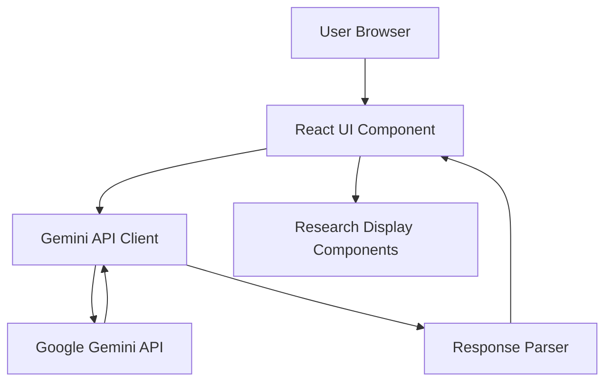

# Design Document

## Overview

The Market Research Tool is a web-based application that leverages Google's Gemini AI model to generate comprehensive market research reports specifically tailored for coding project management tools. The application features a clean, white-themed user interface that presents research data across seven key categories in an organized, visually appealing format.

The system follows a client-side architecture where the frontend application communicates directly with the Gemini API to generate research content, then renders the results in a structured, responsive layout optimized for readability and user experience.

## Architecture

### High-Level Architecture



### Component Structure

The application uses a modular React-based architecture with the following layers:

1. **Presentation Layer**: React components for UI rendering
2. **Service Layer**: API integration and data fetching logic
3. **Data Layer**: Response parsing and data transformation
4. **Styling Layer**: CSS modules or styled-components for white-themed design

### Technology Stack

- **Frontend Framework**: React 18+ with TypeScript
- **AI Integration**: Google Gemini API (gemini-pro model)
- **Styling**: CSS Modules or Tailwind CSS for white-themed design
- **State Management**: React hooks (useState, useEffect)
- **HTTP Client**: Fetch API or Axios for API calls
- **Build Tool**: Vite or Create React App

## Components and Interfaces

### 1. Main Application Component

**Purpose**: Root component that orchestrates the research generation flow

**Props**: None (root component)

**State**:
- `researchData`: Object containing all seven research categories
- `isLoading`: Boolean indicating API call status
- `error`: String containing error messages if any

**Key Methods**:
- `generateResearch()`: Initiates Gemini API call
- `handleError()`: Manages error states

### 2. Research Generator Component

**Purpose**: Handles user input and triggers research generation

**Props**:
- `onGenerate`: Callback function to initiate research
- `isLoading`: Boolean to disable button during generation

**Interface**:
```typescript
interface ResearchGeneratorProps {
  onGenerate: () => Promise<void>;
  isLoading: boolean;
}
```

### 3. Research Display Component

**Purpose**: Container for all research category sections

**Props**:
- `researchData`: Complete research report data

**Interface**:
```typescript
interface ResearchData {
  marketOverview: MarketOverview;
  targetAudience: TargetAudience;
  competitiveAnalysis: CompetitiveAnalysis;
  marketTrends: MarketTrends;
  demandAnalysis: DemandAnalysis;
  researchSources: ResearchSources;
  insights: Insights;
}
```

### 4. Category Card Components

**Purpose**: Individual components for each research category

**Components**:
- `MarketOverviewCard`
- `TargetAudienceCard`
- `CompetitiveAnalysisCard`
- `MarketTrendsCard`
- `DemandAnalysisCard`
- `ResearchSourcesCard`
- `InsightsCard`

**Common Props Interface**:
```typescript
interface CategoryCardProps {
  data: CategoryData;
  icon?: React.ReactNode;
}
```

### 5. Gemini API Service

**Purpose**: Encapsulates all Gemini API interactions

**Interface**:
```typescript
interface GeminiService {
  generateMarketResearch(context: string): Promise<ResearchData>;
  parseResponse(response: string): ResearchData;
}
```

**Methods**:
- `generateMarketResearch()`: Sends prompt to Gemini and returns structured data
- `parseResponse()`: Transforms Gemini's text response into typed data structures

## Data Models

### MarketOverview

```typescript
interface MarketOverview {
  industryDescription: {
    size: string;
    maturity: 'emerging' | 'established' | 'mature';
    keyTrends: string[];
  };
  marketSize: {
    tam: string;
    sam: string;
    som: string;
  };
  growthRate: {
    cagr: string;
    yoyGrowth: string;
  };
  regulatoryFactors: string[];
}
```

### TargetAudience

```typescript
interface TargetAudience {
  demographics: {
    age: string;
    gender: string;
    income: string;
    education: string;
    occupation: string[];
  };
  psychographics: {
    interests: string[];
    values: string[];
    motivations: string[];
    lifestyle: string;
  };
  behavioralData: {
    purchaseHabits: string[];
    usageFrequency: string;
    brandLoyalty: string;
  };
  painPoints: string[];
  customerSegments: CustomerSegment[];
}

interface CustomerSegment {
  name: string;
  description: string;
  size: string;
}
```

### CompetitiveAnalysis

```typescript
interface CompetitiveAnalysis {
  directCompetitors: Competitor[];
  indirectCompetitors: Competitor[];
  marketShare: MarketShareData[];
  swotAnalysis: {
    strengths: string[];
    weaknesses: string[];
    opportunities: string[];
    threats: string[];
  };
  comparison: ComparisonData;
}

interface Competitor {
  name: string;
  description: string;
  marketPosition: string;
}

interface ComparisonData {
  pricing: string[];
  features: string[];
  marketing: string[];
}
```

### MarketTrends

```typescript
interface MarketTrends {
  emergingTrends: Trend[];
  unmetNeeds: string[];
  growthDrivers: {
    technological: string[];
    social: string[];
    economic: string[];
  };
  barriersToEntry: Barrier[];
}

interface Trend {
  name: string;
  description: string;
  impact: 'high' | 'medium' | 'low';
}

interface Barrier {
  type: string;
  description: string;
  severity: 'high' | 'medium' | 'low';
}
```

### DemandAnalysis

```typescript
interface DemandAnalysis {
  historicalDemand: {
    trends: string[];
    seasonalEffects: string[];
  };
  adoptionCurve: {
    currentStage: string;
    description: string;
  };
  marketReadiness: {
    score: string;
    factors: string[];
  };
  elasticity: {
    priceElasticity: string;
    featureElasticity: string;
  };
}
```

### ResearchSources

```typescript
interface ResearchSources {
  primaryResearch: {
    methods: string[];
    description: string;
  };
  secondaryResearch: {
    sources: Source[];
  };
}

interface Source {
  type: string;
  name: string;
  description?: string;
}
```

### Insights

```typescript
interface Insights {
  interpretation: string[];
  targetSegments: {
    segment: string;
    priority: number;
    rationale: string;
  }[];
  positioning: {
    strategy: string;
    differentiators: string[];
  };
  risks: string[];
  opportunities: {
    shortTerm: string[];
    longTerm: string[];
  };
}
```

## UI Design System

### Color Palette

**Primary Colors**:
- Background: `#FFFFFF` (Pure White)
- Card Background: `#FAFAFA` (Off-White)
- Text Primary: `#1A1A1A` (Near Black)
- Text Secondary: `#666666` (Medium Gray)

**Accent Colors**:
- Primary Accent: `#4A90E2` (Blue)
- Success: `#4CAF50` (Green)
- Warning: `#FF9800` (Orange)
- Error: `#F44336` (Red)

**Border Colors**:
- Light Border: `#E0E0E0`
- Medium Border: `#BDBDBD`

### Typography

**Font Family**: 
- Primary: 'Inter', 'Segoe UI', system-ui, sans-serif
- Monospace: 'Fira Code', 'Courier New', monospace

**Font Sizes**:
- Heading 1: 32px (2rem)
- Heading 2: 24px (1.5rem)
- Heading 3: 20px (1.25rem)
- Body: 16px (1rem)
- Small: 14px (0.875rem)
- Caption: 12px (0.75rem)

**Font Weights**:
- Regular: 400
- Medium: 500
- Semibold: 600
- Bold: 700

### Spacing System

Based on 8px grid:
- xs: 4px
- sm: 8px
- md: 16px
- lg: 24px
- xl: 32px
- 2xl: 48px
- 3xl: 64px

### Component Styling

**Card Component**:
```css
.card {
  background: #FFFFFF;
  border: 1px solid #E0E0E0;
  border-radius: 12px;
  padding: 24px;
  margin-bottom: 24px;
  box-shadow: 0 2px 8px rgba(0, 0, 0, 0.04);
  transition: box-shadow 0.3s ease;
}

.card:hover {
  box-shadow: 0 4px 16px rgba(0, 0, 0, 0.08);
}
```

**Button Component**:
```css
.button-primary {
  background: #4A90E2;
  color: #FFFFFF;
  border: none;
  border-radius: 8px;
  padding: 12px 24px;
  font-size: 16px;
  font-weight: 600;
  cursor: pointer;
  transition: background 0.2s ease;
}

.button-primary:hover {
  background: #357ABD;
}

.button-primary:disabled {
  background: #BDBDBD;
  cursor: not-allowed;
}
```

### Layout Structure

**Container**:
- Max width: 1200px
- Padding: 24px (mobile), 48px (desktop)
- Centered with auto margins

**Grid System**:
- Single column on mobile (< 768px)
- Two columns on tablet (768px - 1024px)
- Three columns on desktop (> 1024px) for certain sections

## Gemini API Integration

### Prompt Engineering

**System Prompt Template**:
```
You are a market research expert specializing in software project management tools. 
Generate a comprehensive market research report for coding project management solutions.

Structure your response with the following sections:

1. MARKET OVERVIEW
   - Industry description (size, maturity, key trends)
   - Market size (TAM, SAM, SOM)
   - Growth rate (CAGR, YoY)
   - Regulatory factors

2. TARGET AUDIENCE
   - Demographics
   - Psychographics
   - Behavioral data
   - Pain points
   - Customer segments

3. COMPETITIVE ANALYSIS
   - Direct competitors
   - Indirect competitors
   - Market share
   - SWOT analysis
   - Pricing/features/marketing comparison

4. MARKET TRENDS
   - Emerging trends
   - Unmet needs
   - Growth drivers
   - Barriers to entry

5. DEMAND ANALYSIS
   - Historical demand
   - Adoption curve
   - Market readiness
   - Elasticity

6. RESEARCH SOURCES
   - Primary research methods
   - Secondary research sources

7. INSIGHTS AND RECOMMENDATIONS
   - Data interpretation
   - Target segments priority
   - Positioning strategy
   - Risks and gaps
   - Short-term and long-term opportunities

Provide specific, actionable data relevant to the project management software industry.
```

### API Configuration

```typescript
const geminiConfig = {
  apiKey: process.env.VITE_GEMINI_API_KEY,
  model: 'gemini-pro',
  generationConfig: {
    temperature: 0.7,
    topK: 40,
    topP: 0.95,
    maxOutputTokens: 8192,
  },
  safetySettings: [
    {
      category: 'HARM_CATEGORY_HARASSMENT',
      threshold: 'BLOCK_MEDIUM_AND_ABOVE',
    },
    {
      category: 'HARM_CATEGORY_HATE_SPEECH',
      threshold: 'BLOCK_MEDIUM_AND_ABOVE',
    },
  ],
};
```

### Response Parsing Strategy

The Gemini response will be in markdown/text format. The parser will:

1. Split response by section headers (## or ###)
2. Extract content under each section
3. Parse lists, bullet points, and structured data
4. Map to TypeScript interfaces
5. Validate required fields
6. Provide default values for missing data

```typescript
function parseGeminiResponse(response: string): ResearchData {
  const sections = splitIntoSections(response);
  
  return {
    marketOverview: parseMarketOverview(sections['MARKET OVERVIEW']),
    targetAudience: parseTargetAudience(sections['TARGET AUDIENCE']),
    competitiveAnalysis: parseCompetitiveAnalysis(sections['COMPETITIVE ANALYSIS']),
    marketTrends: parseMarketTrends(sections['MARKET TRENDS']),
    demandAnalysis: parseDemandAnalysis(sections['DEMAND ANALYSIS']),
    researchSources: parseResearchSources(sections['RESEARCH SOURCES']),
    insights: parseInsights(sections['INSIGHTS AND RECOMMENDATIONS']),
  };
}
```

## Error Handling

### Error Types

1. **API Errors**:
   - Network failures
   - API key invalid
   - Rate limiting
   - Timeout (> 25 seconds)

2. **Parsing Errors**:
   - Malformed response
   - Missing required sections
   - Invalid data format

3. **UI Errors**:
   - Rendering failures
   - State management issues

### Error Handling Strategy

```typescript
interface ErrorState {
  type: 'api' | 'parsing' | 'ui' | 'unknown';
  message: string;
  retryable: boolean;
}

function handleError(error: Error): ErrorState {
  if (error.message.includes('timeout')) {
    return {
      type: 'api',
      message: 'Request timed out. Please try again.',
      retryable: true,
    };
  }
  
  if (error.message.includes('API key')) {
    return {
      type: 'api',
      message: 'Invalid API configuration. Please check your settings.',
      retryable: false,
    };
  }
  
  // Default error handling
  return {
    type: 'unknown',
    message: 'An unexpected error occurred. Please try again.',
    retryable: true,
  };
}
```

### User-Facing Error Messages

- **Timeout**: "The research generation is taking longer than expected. Please try again."
- **API Error**: "Unable to connect to the research service. Please check your connection."
- **Parsing Error**: "Received incomplete data. Retrying..."
- **Generic Error**: "Something went wrong. Please try again."

### Retry Logic

```typescript
async function generateWithRetry(
  maxRetries: number = 2,
  timeout: number = 25000
): Promise<ResearchData> {
  for (let attempt = 0; attempt < maxRetries; attempt++) {
    try {
      const controller = new AbortController();
      const timeoutId = setTimeout(() => controller.abort(), timeout);
      
      const result = await generateMarketResearch({ signal: controller.signal });
      clearTimeout(timeoutId);
      
      return result;
    } catch (error) {
      if (attempt === maxRetries - 1) throw error;
      await delay(1000 * (attempt + 1)); // Exponential backoff
    }
  }
}
```

## Testing Strategy

### Unit Testing

**Components to Test**:
- Response parser functions
- Data transformation utilities
- Error handling logic
- Individual UI components

**Testing Framework**: Jest + React Testing Library

**Example Test Cases**:
```typescript
describe('parseMarketOverview', () => {
  it('should parse valid market overview section', () => {
    const input = `
      Industry: Software PM tools, $50B market, established
      TAM: $50B, SAM: $10B, SOM: $500M
      Growth: 15% CAGR
    `;
    const result = parseMarketOverview(input);
    expect(result.marketSize.tam).toBe('$50B');
  });
  
  it('should handle missing data gracefully', () => {
    const input = 'Incomplete data';
    const result = parseMarketOverview(input);
    expect(result).toBeDefined();
    expect(result.marketSize.tam).toBe('N/A');
  });
});
```

### Integration Testing

**Scenarios**:
- Full flow from button click to data display
- API error handling and retry logic
- Loading states and transitions
- Responsive layout on different screen sizes

### End-to-End Testing

**Tool**: Playwright or Cypress

**Test Scenarios**:
1. User clicks generate button
2. Loading indicator appears
3. Research data loads within 30 seconds
4. All seven categories display correctly
5. UI remains responsive during load
6. Error states display appropriately

### Performance Testing

**Metrics to Monitor**:
- Time to first render: < 2 seconds
- API response time: < 25 seconds
- Total page load time: < 3 seconds
- Lighthouse performance score: > 90

## Deployment Considerations

### Environment Variables

```env
VITE_GEMINI_API_KEY=your_api_key_here
VITE_API_TIMEOUT=25000
VITE_MAX_RETRIES=2
```

### Build Configuration

```typescript
// vite.config.ts
export default defineConfig({
  plugins: [react()],
  build: {
    outDir: 'dist',
    sourcemap: true,
    rollupOptions: {
      output: {
        manualChunks: {
          'react-vendor': ['react', 'react-dom'],
        },
      },
    },
  },
});
```

### Security Considerations

1. **API Key Protection**: Store in environment variables, never commit to repository
2. **CORS Configuration**: Ensure proper CORS headers for API calls
3. **Input Sanitization**: Sanitize any user inputs before sending to API
4. **Content Security Policy**: Implement CSP headers to prevent XSS
5. **Rate Limiting**: Implement client-side rate limiting to prevent abuse

## Future Enhancements

1. **Export Functionality**: Allow users to export reports as PDF or Markdown
2. **Comparison Mode**: Compare multiple research reports side-by-side
3. **Custom Prompts**: Allow users to customize research focus areas
4. **Historical Reports**: Save and retrieve previous research reports
5. **Collaborative Features**: Share reports with team members
6. **Data Visualization**: Add charts and graphs for quantitative data
7. **Real-time Updates**: Stream Gemini responses as they generate
